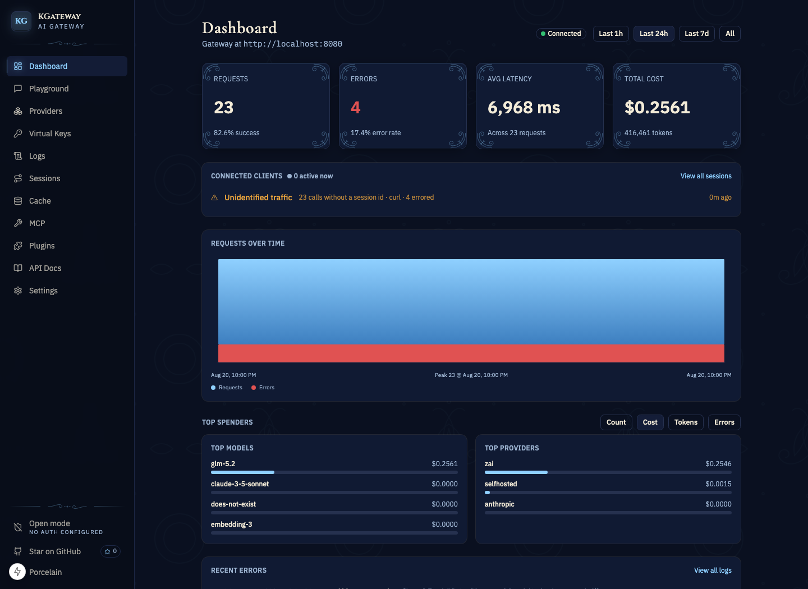
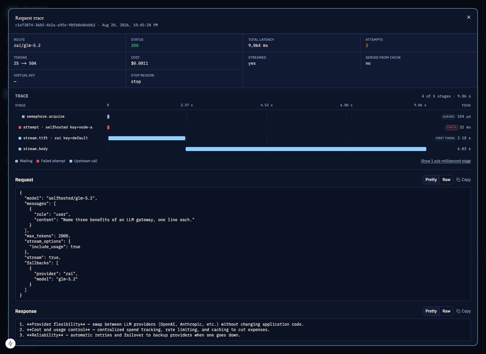
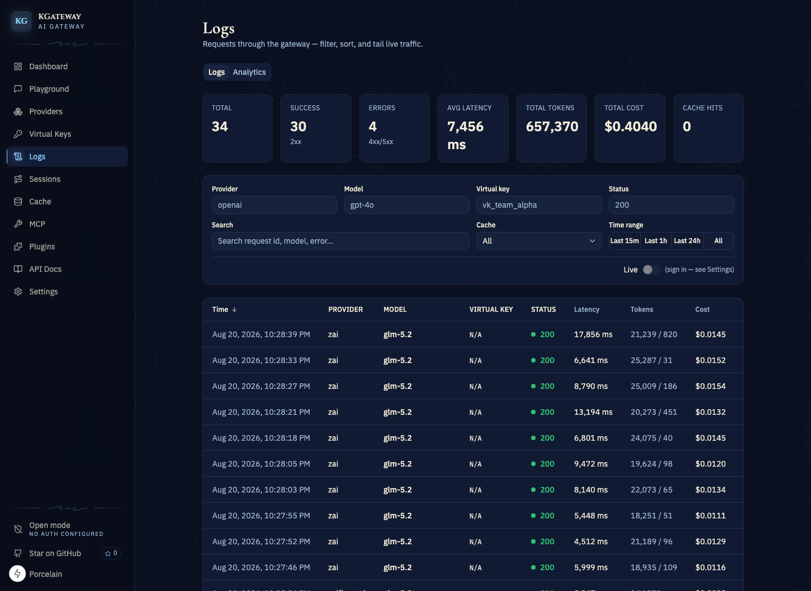
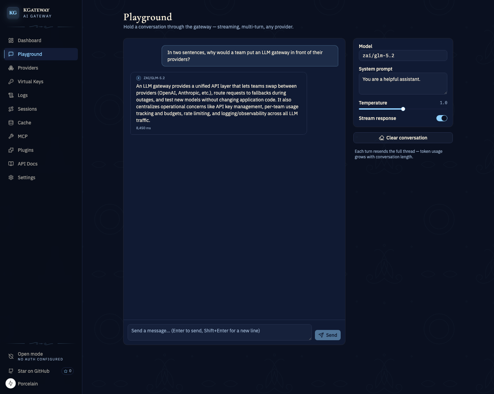
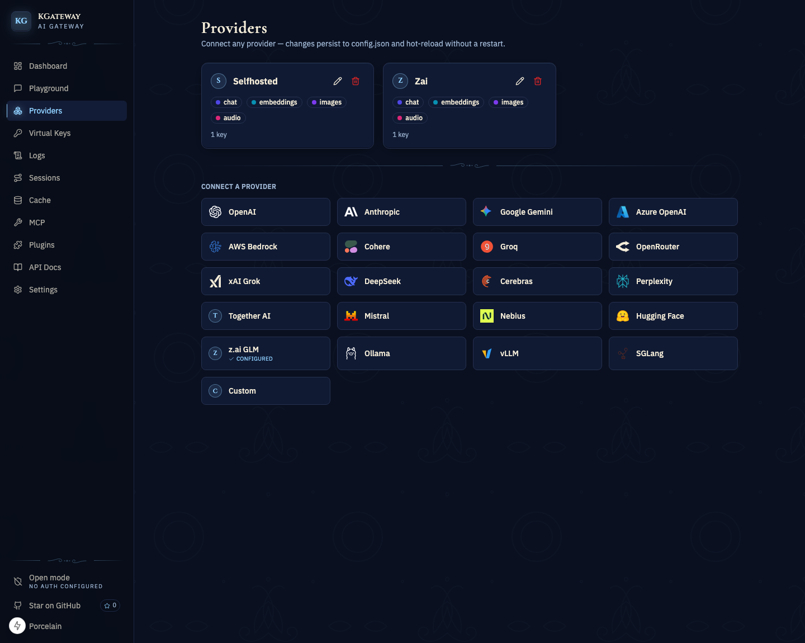

<div align="center">

# KGateway

**One OpenAI-compatible API in front of 35 LLM providers.**

Failover · load balancing · semantic cache · budgets & rate limits · PII redaction · tracing · dashboard

Built in Rust. **~3.5 µs** of overhead per request.

[](https://github.com/kelvin6365/KGateway/actions/workflows/ci.yml)
[](./LICENSE)
[](#local-development)

[Quick start](#quick-start) · [Features](#features) · [Local development](#local-development) · [Docs](docs/README.md)

</div>

---



<details>
<summary><b>More screenshots</b> — request tracing, logs, playground, providers</summary>

### Per-request tracing

Every request records a stage-by-stage waterfall. Here a call to a self-hosted node fails in
439 µs, fails over to a second provider, and still streams a first token 2.29 s in — the client
never sees the failure.



### Logs

Filter by provider, model, virtual key, status, or free text; tail live traffic over SSE.



### Playground

Multi-turn, streaming, against any configured `provider/model`.



### Providers

Connect a provider from the catalog — changes persist to `config.json` and hot-reload without a
restart.



</details>

## Why KGateway?

- **One API, every provider.** Point any OpenAI SDK at KGateway and switch between 35 providers
  by changing a `"provider/model"` string — no per-vendor client code.
- **Requests don't drop.** Provider failover + weighted key rotation + retry with backoff, on
  unary **and** streaming (a first-chunk peek fails over before the client sees a byte).
- **Spend stays capped.** Virtual keys with model allow-lists, rate limits, token budgets, and
  USD cost budgets — enforced across replicas via a shared Postgres counter store.
- **Repeat prompts are free.** A two-tier semantic cache (exact hash, then embedding similarity)
  answers near-duplicate prompts without touching a provider.
- **You can see everything.** Per-request waterfall traces, filterable audit logs with live SSE
  tail, analytics, Prometheus `/metrics`, OTLP export — and a full Next.js dashboard.
- **It's fast.** The full production pipeline (logging + governance) adds **~3.5 µs** per
  request ([benchmarks](docs/15-performance.md)).

## Quick start

### Option A — Docker (nothing to install but Docker)

```bash
git clone https://github.com/kelvin6365/KGateway.git && cd KGateway
cp config.example.json config.json
OPENAI_API_KEY=sk-... docker compose up --build
```

### Option B — from source (Rust 1.88+)

```bash
git clone https://github.com/kelvin6365/KGateway.git && cd KGateway
cp config.example.json config.json
export OPENAI_API_KEY=sk-...
cargo run -p kgateway-server -- --config config.json
# → kgateway listening on 0.0.0.0:8080
```

(Or let `./scripts/start.sh` generate a config from whatever keys are in your env, ask
whether to start the dashboard alongside, and run everything in one step —
`KGATEWAY_START_UI=1|0` answers the prompt non-interactively.)

### Send your first request

Everything is OpenAI-compatible. Models are addressed as `provider/model`:

```bash
curl http://localhost:8080/v1/chat/completions \
  -H 'content-type: application/json' \
  -d '{"model":"openai/gpt-4o","messages":[{"role":"user","content":"hi"}]}'
```

Or use any OpenAI SDK unchanged:

```python
from openai import OpenAI

client = OpenAI(base_url="http://localhost:8080/v1", api_key="unused")

resp = client.chat.completions.create(
    model="openai/gpt-4o",          # switch providers by changing the prefix:
    # model="anthropic/claude-3-5-sonnet",  "groq/llama-3.1-70b",  "ollama/llama3", ...
    messages=[{"role": "user", "content": "hi"}],
)
```

Streaming (`"stream": true`), embeddings, images, audio, and rerank work the same way. Add a
failover chain per request with `"fallbacks": [{"provider": "anthropic", "model": "claude-3-5-sonnet"}]`.

### Open the dashboard

```bash
cd ui
pnpm install
NEXT_PUBLIC_KGATEWAY_URL=http://localhost:8080 pnpm dev
# → http://localhost:3000
```

Playground, live logs, analytics, provider management, cache, MCP tools, and generated API docs.

### Use it with coding agents

KGateway also exposes an **Anthropic-compatible `/v1/messages`** ingress (streaming + tool use),
so Anthropic-protocol clients such as **Claude Code** route through the gateway to *any*
provider — with governance, logging, failover, and caching applied:

```bash
export ANTHROPIC_BASE_URL=http://localhost:8080   # base URL — Claude Code appends /v1/messages
export ANTHROPIC_AUTH_TOKEN=local                 # any token; a virtual key if governance is on
export ANTHROPIC_MODEL="zai/glm-4.6"              # provider/model picks the route
claude
```

Setup guides for Claude Code, the OMP CLI, and the Pi CLI — including the common traps — are in
[`docs/08-getting-started.md`](docs/08-getting-started.md).

## Features

| Area | Capabilities |
|---|---|
| **API** | OpenAI-compatible `/v1/chat/completions` (JSON + SSE), `/v1/embeddings`, `/v1/images/generations`, `/v1/audio/speech`, `/v1/audio/transcriptions`, `/v1/rerank`, aggregated `/v1/models`, plus **Anthropic-compatible `/v1/messages`** ingress. Full request-param fidelity (`seed`, `response_format`, penalties, tool-choice, …) and an `extra` passthrough so no client field is dropped. |
| **Providers (35)** | **Native:** OpenAI, Anthropic, Cohere, Amazon Bedrock, Bedrock Mantle, Google Gemini, Google Vertex AI, Azure OpenAI, Replicate, ElevenLabs, Sarvam, Runway, Runware. **OpenAI-compatible:** Groq, OpenRouter, xAI, DeepSeek, Cerebras, Perplexity, Together, Fireworks, Parasail, Mistral, Nebius, HuggingFace, z.ai GLM, Moonshot (Kimi), MiniMax, Ollama, vLLM, SGLang, Opencode Zen, Opencode Go, Wafer. See the [verification-status table](docs/03-providers.md#verification-status). |
| **Routing** | Primary + `fallbacks[]` provider failover, weighted key selection, per-key retry with backoff + jitter, per-provider concurrency isolation, dead-key vs used-key rotation — on unary **and** streaming. |
| **Governance** | Virtual keys: model allow/deny-lists, request rate limits, token budgets, per-period USD cost budgets. In-process counters by default, **shared Postgres** for horizontal scaling. |
| **Caching** | Two-tier semantic cache (exact-hash tier + embedding similarity), params/model-scoped. In-memory or persistent **pgvector** (survives restart, shared across replicas). |
| **Security** | Reversible AES-256-GCM redaction of captured bodies, RBAC (viewer/operator/admin) with fail-closed tokens, audited reveal. |
| **Observability** | Request audit log (filters + pagination + SSE tail), **per-request call tracing** (stage-by-stage waterfall incl. failed retries and time-to-first-token), analytics, opt-in content capture, Prometheus `/metrics`, **OTLP** traces + metrics with W3C `traceparent` propagation. |
| **MCP** | Agentic tool-calling over in-process + stdio MCP servers: discover → inject → execute → re-prompt. |
| **Docs for agents** | `/openapi.json`, `/llms.txt`, `/llms-full.txt`, and per-endpoint Markdown served straight off the gateway — generated from the route table and pinned to it by a test. |
| **Persistence** | SQLite (default) and Postgres behind store traits; in-memory fallback. |
| **Deploy** | Docker (single container + SQLite) or Helm (SQLite/Postgres, HPA, Ingress). |

## Performance

Rust core, measured with `cargo bench` against an instant mock provider (KGateway's own
overhead, no network). Full detail in [`docs/15-performance.md`](docs/15-performance.md).

| Path | Overhead |
|---|---|
| Bare engine (`chat` pipeline) | **~2.9 µs** |
| **Full production observability** (logging + governance) | **~3.5 µs / request** |
| + request/response content capture | ~4.3 µs |
| Redaction — no secrets (`RegexSet` prefilter miss) | ~0.30 µs |
| Weighted key selection (8 keys) | ~99 ns |

## Local development

### Prerequisites

- **Rust 1.88+** (MSRV; edition 2021)
- **Node 22+** and **pnpm** — only for the dashboard
- Optional: **Docker** for containerized runs, **Postgres** for the shared-counter / pgvector paths

### Run the backend

```bash
cp config.example.json config.json   # gitignored; keys come from ${ENV}, never hard-coded
export OPENAI_API_KEY=sk-...
cargo run -p kgateway-server -- --config config.json
```

Config hot-reloads without a restart: edit `config.json` and `kill -HUP $(pgrep -f kgateway-server)`.

### Run the dashboard

```bash
cd ui
pnpm install
NEXT_PUBLIC_KGATEWAY_URL=http://localhost:8080 pnpm dev   # http://localhost:3000
```

### Test & lint (the quality gate)

Every change should leave this green — it's what CI runs:

```bash
cargo fmt --all --check
cargo clippy --workspace --all-targets -- -D warnings
cargo test --workspace                 # ~230 tests; no live DB or API keys required
# if ui/ changed:
pnpm --dir ui lint && pnpm --dir ui build
```

Postgres integration tests are env-gated (`KGATEWAY_TEST_PG`, `KGATEWAY_TEST_PGVECTOR`) and skip
when unset. Benchmarks: `cargo bench -p kgateway-core`.

### Workspace layout

Dependency direction: `server → plugins / providers / store → core`. Nothing depends on `server`.

| Crate | Role |
|---|---|
| `kgateway-core` | The engine: schemas, `Provider`/`LlmPlugin`/`RequestObserver` traits, routing + failover, streaming, plugin pipeline. No HTTP dependency — embeddable. |
| `kgateway-providers` | Provider connectors: 13 native + the OpenAI-compatible factory (22 vendors). |
| `kgateway-plugins` | Built-in plugins: logging, governance, semantic cache, redaction, pricing. |
| `kgateway-store` | Persistence behind `LogStore` / `VectorStore` / `GovernanceStore` traits — in-memory, SQLite, Postgres. |
| `kgateway-server` | axum HTTP gateway + control plane (the binary). |
| `ui/` | Next.js 15 (App Router) + Tailwind + shadcn/ui dashboard. |

### Adding things

- **New OpenAI-compatible provider** — one `(name, base_url)` entry in `openai_compat::KNOWN`.
- **New native provider** — implement the `Provider` trait in `kgateway-providers`, register in
  `app.rs`, add SSE-parse + error-mapping tests.
- **New plugin** — implement `LlmPlugin` or `RequestObserver` in `kgateway-plugins`, wire in `app.rs`.
- **New endpoint** — register in `app.rs` **and** `api_catalog::ENDPOINTS`; a drift test fails if
  the two disagree.

Architecture deep-dives live in [`docs/`](docs/README.md) — start with
[`docs/01-architecture.md`](docs/01-architecture.md).

## Deploy

```bash
# Docker — single container + SQLite volume
OPENAI_API_KEY=sk-... docker compose up --build

# Kubernetes — SQLite (single replica + PVC)
helm install kg charts/kgateway --set secretEnv.OPENAI_API_KEY=sk-...

# Kubernetes — Postgres (multi-replica + HPA)
helm install kg charts/kgateway \
  --set database.mode=postgres \
  --set database.url='postgres://user:pass@pg:5432/kgateway' \
  --set replicaCount=3 --set autoscaling.enabled=true \
  --set secretEnv.OPENAI_API_KEY=sk-...
```

See [`docs/06-deployment.md`](docs/06-deployment.md).

## Documentation

| | |
|---|---|
| [Getting started](docs/08-getting-started.md) | 5-minute guide: run, first request, dashboard, Claude Code / OMP / Pi setup, troubleshooting |
| [Configuration reference](docs/16-configuration.md) | Every config field, type, and default |
| [Architecture](docs/01-architecture.md) | Engine, traits, request flow, streaming |
| [Providers](docs/03-providers.md) | All 35 providers + live-verification status |
| [Security](docs/09-security.md) | Redaction, RBAC, key handling |
| [Performance](docs/15-performance.md) | Benchmark methodology + results |
| [Roadmap](docs/02-roadmap.md) | Milestone history and what's next |

## Contributing

Contributions are welcome — bug reports, provider connectors, plugins, docs.

1. Fork and branch.
2. Ship tests with the code (table-driven `#[tokio::test]`, matching the crate's existing style).
3. Run the [quality gate](#test--lint-the-quality-gate) — CI enforces fmt, clippy `-D warnings`,
   tests, an MSRV (1.88) build, the UI build, and the Docker build.
4. Never commit a real API key. Configs reference secrets as `${ENV}` only.

By contributing, you agree to the [CLA](./COMMERCIAL_LICENSE.md#contributor-license-agreement-cla).

## License

**Dual-licensed** — choose what fits your use case:

| | AGPL-3.0 (Open Source) | Commercial License |
|---|---|---|
| Self-host, modify, contribute | ✅ Free | ✅ Free |
| Offer as a managed/SaaS service | ✅ Must open-source changes | ✅ No sharing required |
| Embed in closed-source product | ❌ | ✅ |
| SSO, SLA, indemnification | — | ✅ |

- **Open source:** [AGPL-3.0](./LICENSE) — free for self-hosting, modification, and
  contribution. If you offer KGateway as a network service, you must open-source your
  modifications.
- **Commercial:** for closed-source use, managed services, or enterprise features, contact
  **kelvin.kwong@2rocksstudio.hk**. See [`COMMERCIAL_LICENSE.md`](./COMMERCIAL_LICENSE.md).
